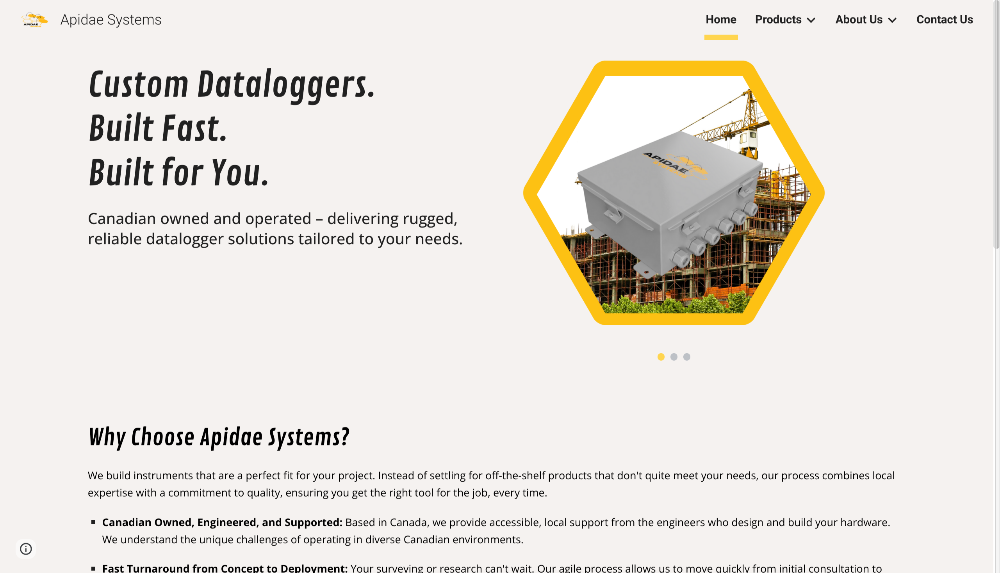
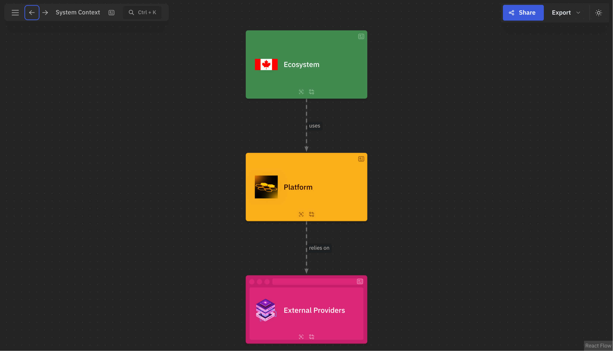

#+ATTR_HTML: :align center
#+ATTR_ORG: :align center

| [[https://apidaesystems.ca][Website]]              | [[https://arch.apidaesystems.ca][Architecture]]          |
|  |  |

Work in progress.

[NON NIXOS USERS] Contributing:

1. Install [[https://lix.systems/install/][Lix]] (fork of [[https://determinate.systems][Determinate Nix]])

If installing for the first time:
#+begin_src sh
curl -sSf -L https://install.lix.systems/lix | sh -s -- install
#+end_src

OPTIONAL: Replace existing Nix install (provides performance improvements over regular [[https://nixos.org][Nix]] implementation):
#+begin_src sh
sudo --preserve-env=PATH nix run \
     --experimental-features "nix-command flakes" \
     --extra-substituters https://cache.lix.systems --extra-trusted-public-keys "cache.lix.systems:aBnZUw8zA7H35Cz2RyKFVs3H4PlGTLawyY5KRbvJR8o=" \
     'git+https://git.lix.systems/lix-project/lix?ref=refs/tags/2.93.3' -- \
     upgrade-nix \
     --extra-substituters https://cache.lix.systems --extra-trusted-public-keys "cache.lix.systems:aBnZUw8zA7H35Cz2RyKFVs3H4PlGTLawyY5KRbvJR8o="
#+end_src

2. Install [[https://devenv.sh][Devenv]] & [[https://direnv.net][Direnv]]

#+begin_src sh
nix profile install nixpkgs#{devenv,direnv}
#+end_src

OPTIONAL: Add [[https://direnv.net/docs/hook.html][direnv hook]] for auto-loads when entering/traversing repository filesystem

2. Set up embedded Rust toolchain

[[https://docs.espressif.com/projects/rust/book/preface.html
][The Rust on ESP Book]]
[[https://esp32.implrust.com/index.html][Impl Rust for ESP32]]
[[https://docs.rust-embedded.org/discovery/microbit/index.html][Embedded Rust on STM32]]
